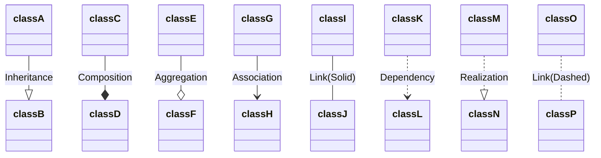
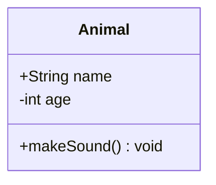

# Container della STL
## Container Associativi
**Mappa Ordinata**
```cpp
std::map<KeyType, ValueType>
```

La mappa ordinata è un tipo di contenitore associativo che rimane ordinato. Di sotto le funzionalità principali di una mappa. Da ricordare che si può interpretare la mappa come una sorta di vettore composto da *pair* -> std::pair<KeyType, ValueType>.

```cpp
std::map<std::string, int> mappa;

// Per aggiungere un elemento alla mappa esistono due modi.
// O si usa la funzione insert che prende un pair
auto pair = std::pair{"Marco", 56};
mappa.insert(pair);
// che in maniera compatta è:
mappa.insert(std::make_pair("Marco", 56));
```

```cpp
// Oppure si usa la funzione emplace che crea un pair e lo inserisce
mappa.emplace("Marco", 56);
```

```cpp
//È possibile accedere a qualunque elemento utilizzando la chiave con l'operatore [] o con la funzione at(). at() è più moderno. Ma meno intuitivo
mappa["Marco"] // Nota che [] restituisce un riferimento. Se quindi Value type è un oggetto si può fare mappa[Key].metodo(). Se ValueType è un puntatore ad un oggetto si può fare mappa[Key]->metodo().
```

```cpp
// Se bisogna effettuare delle operazioni su tutti i valori di una mappa si può fare:
for(auto& [key, value] : mappa) {
	if(key == "something")
		value++;
}

// Oppure per stampare:
for(const auto& [key, value] : mappa) {
	std::cout << "Chiave: " << key << " Valore: " << value << std::endl;
}
```

```cpp
// Per trovare un oggetto si usa la funzione find() che restituisce un iteratore. Può essere ad esempio usato con comparazione a end() per verificare se un elemento si trova o meno nella lista.
if(mappa.find(Key) != mappa.end())
	//dosomething
// Anche se per questo scopo esiste 
if(mappa.contains(Key)) 
```

```cpp
// Per eliminare un elemento da una lista è sufficiente fare
mappa.erase("Marco");
```

Il funzionamento di una mappa è simile a quello di una unordered_map
# Container Sequenziali
>[!important]
>>Ricordati che sia le liste che i vettori hanno dei metodi molto comodi per accedere agli elementi (anche se con efficienze diverse).
>
>**Creazione di default**
>Posso creare un nuovo vettore, deque o lista inzializzando n elementi ad un valore di default con le parentesi.
> - std::list<\Pixel> image(n_pixel, Pixel(0, 0, 0));
>- std::deque<\Pixel> image(n_pixel, Pixel(0, 0, 0));
>- std::vector<\Pixel> image(n_pixel, Pixel(0, 0, 0));
>
>Questo crea un contenitore di dimensione n_pixel, i cui elementi sono tutti inizializzati ad un Pixel con 0, 0, 0 ovvero di colore nero.
>
>Per riassegnare tutti i valori di un container che era già stato creato basta chiamare il metodo assign(n , type). Ad esempio:
>image.assign(n_pixel, Pixel(0, 0, 0));
>...
>
 **std::prev( list.end( ), n ) e std::next( list.begin( ) , n )**
> Sono due metodi molto utili che permettono di tornare indietro (prev) e avanzare di n posizioni. Ad esempio se voglio l'ultimo elemento della lista mi sarà sufficiente fare std::prev(list.end(), 1), oppure se voglio il penultimo std::prev(list.end(), 2). Questi due metodi non danno errori perché sono ciclici. Se il terzultimo non è definito si torna all'ultimo e così via.
> 
> **list.front() e vector.back()**
> Sono due metodi che servono per accedere rispettivamente al primo e all'ultimo elemento di una lista o di un vettore. Ad esempio se ho un vettore di std::pair<> per accedere alla chiave del primo elemento è sufficiente fare:
> vector.front().first;
> 
> **Per eliminare il primo elemento**
> Questo modo è definito per qualsiasi contenitore. Ma ha efficienze diverse in base al tipo.
> auto it = list.begin();
> list.erase(it);
> 
> Per le liste e le deque invece è definito anche
> list.pop_front();
> deque.pop_front();


## List
Una lista è un contenitore i cui nodi sono collegati da puntatori. Dunque il contenuto non è definito in posizioni contigue di memoria. Risulta comodo quando si devono eliminare elementi (anche nel mezzo). 

```cpp
std::list<type> name;

// Se viene chiesto di inserire un elemento in fondo alla lista:
// Si utilizza il metodo .push_back();

name.push_back(element_of_type);
```

```cpp
// Se viene chiesto di inserire un elemento in fondo alla lista e allo stesso tempo crearlo: 
//si utilizza il metodo .emplace_back(); Ad esempio potrei avere una lista di oggetti. Col metodo emplace_back() posso evitare di creare un oggetto e poi assegnarlo posso fare tutto insieme.

std::list<President> elections;
elections.emplace_back("Nelson Mandela", "South Africa", 1994);

// Risulta utile (come nel caso delle mappe) se ho una lista fatta di pair<type> perché posso evitare di usare election.push_back(std::make_pair("", n));
```

```cpp
// Se viene chiesto di inserire un elemento in un punto specifico
// Si deve utilizzare i metodi .insert(), std::next(it, spaces);

// Esempio voglio aggiungere un elemento alla lista nella terza posizione:
auto it = list.begin();
list.insert(std::next(it, 2), value);
// NOTA! IL METODO NEXT È CICLICO (QUANDO ECCEDE TORNA AL PRIMO ELEMENTO) QUINDI NON DARÀ MAI ERRORE SE LA POSIZIONE NELLA QUALE SI VUOLE INSERIRE ECCEDE LA DIMENSIONE.

// Se invece voglio "inserire" nel senso di sostituire un elemento ad una posizione specifica posso usare l'uguale. Questo perché la lista non consente l'accesso diretto agli elementi.
auto it = list.begin();
it = std::next(it, 4); // Quinto elemento della lista;
*it = value;
```

```cpp
// Se viene chiesto di rimuovere un elemento in un punto specifico
// Basta utilizzare la funzione .erase(iteratore)

// Ad esempio se voglio eliminare l'elemento nella quarta posizione posso fare:
auto it = list.begin();
list.erase(std::next(it, 3), value);
```

```cpp
// Se viene chiesto di rimuovere un elemento specifico
// Solo per la lista. Si può usare il metodo .remove(element).

list.remove(element);
// Ad esempio posso rimuovere tutti gli elementi di una lista uguale a 3 facendo
list.remove(3);

// NOTA! POSSO RIMUOVERE ANCHE DEGLI OGGETTI USER-DEFINED COME DELLE CLASSI MA DEVO ASSICURARMI DI AVER SOVRACCARICATO L'OPERATORE == NEL CASO IN CUI IL MIO OGGETTO GESTISCA DELLE RISORSE. ALTRIMENTI NON SERVE PERCHÈ CI PENSA GIÀ IL COMPILATORE.

// Non si può utilizzare remove se l'element è un unique_ptr perché == non è definito.

```

```cpp
// Se voglio eliminare il primo elemento della list posso fare:
list.pop_front(); // Metodo più veloce ed ottimale deifnito solo per le liste e per le deque
```

```cpp
// Se viene chiesto se un elemento è presente nella lista
// Esistono due modi. 

// Metodo esteso. Si fa un controllo manuale.
for(const auto& element : list){
	if(element == value)
		return true;
}

return false;

// Altrimenti si può usare il metodo della STL
auto it = std::find(list.begin(), list.end(), element);
if(it != list.end())
	return true;
else
	return false;
```

Certo! Ecco un'illustrazione delle stesse indicazioni, ma per i `vector` in C++.

## Vector
Un `vector` è un contenitore che memorizza gli elementi in posizioni contigue di memoria. Questo lo rende molto efficiente per l'accesso casuale agli elementi, ma meno efficiente per l'inserimento e la rimozione di elementi in posizioni diverse dalla fine.

```cpp
std::vector<type> name;

// Se viene chiesto di inserire un elemento in fondo al vector:
// Si utilizza il metodo .push_back();

name.push_back(element_of_type);
```

```cpp
// Se viene chiesto di inserire un elemento in fondo al vector e allo stesso tempo crearlo: 
// si utilizza il metodo .emplace_back(); Ad esempio, potrei avere un vector di oggetti. Con emplace_back() posso evitare di creare un oggetto e poi assegnarlo, posso fare tutto insieme.

std::vector<President> elections;
elections.emplace_back("Nelson Mandela", "South Africa", 1994);

// Risulta utile se ho un vector fatto di pair<type> perché posso evitare di usare elections.push_back(std::make_pair("", n));
```

```cpp
// Se viene chiesto di inserire un elemento in un punto specifico
// Si deve utilizzare il metodo .insert().

// Esempio: voglio aggiungere un elemento al vector nella terza posizione:
auto it = vector.begin();
vector.insert(it + 2, value); // Aggiunge 'value' alla terza posizione (indice 2). Qui si può usare la somma nell'iteratore perché gli elementi sono contigui in memoria.
```

```cpp
// Se invece voglio "inserire" nel senso di sostituire un elemento a una posizione specifica
// Posso usare l'operatore di assegnazione.

auto it = vector.begin();
it += 4; // Quinto elemento del vector;
*it = value; // Sostituisce il quinto elemento con 'value'.

// Ma posso fare anche:
vector[4] = value; // Ricordati che gli indici partono da 0. Questo metodo non effettua controlli sulla dimensione.

vector.at(4) = value; // Questo metodo invece lancia un'eccezione se si supera la dimensione.
```

```cpp
// Se viene chiesto di rimuovere un elemento in un punto specifico
// Basta utilizzare la funzione .erase(iteratore).

// Ad esempio, se voglio eliminare l'elemento nella quarta posizione posso fare:
auto it = vector.begin();
vector.erase(it + 3); // Rimuove l'elemento alla quarta posizione (indice 3).
```

```cpp
// Se viene chiesto di rimuovere un elemento specifico
// Si può usare il metodo find e poi erase che prende un iteratore.

auto it = std::find(vector.begin(), vector.end(), element);
if(it != vector.end())
	vector.erase(it);
```

```cpp
// Se viene chiesto se un elemento è presente nel vector
// Esistono due modi. 

// Metodo esteso. Si fa un controllo manuale.
for(const auto& element : vector){
	if(element == value)
		return true;
}

return false;

// Altrimenti si può usare il metodo della STL
auto it = std::find(vector.begin(), vector.end(), element);
if(it != vector.end())
	return true;
else
	return false;
```

**NOTA!** Si possono inizializzare sia le liste che i vettori con un numero iniziale di elementi tutti con lo stesso valore. Sintassi:
```cpp
std::vector<type> name(num_elements, default_value);
std::list<type> name(num_elements, default_value);
```

## Deque
Ci sarebbero anche le deque. I metodi della deque sono simili a quelle di una vector. Ho usato raramente le deque. Per le deque è definito l'accesso ad una posizione specifica ma non è buono per aggiungere elementi in mezzo.

## Pair
È un container della STL che consente di associare ad ogni elemento una chiave. Si può  accedere al primo o al secondo elemento con .first o .second **SENZA LE PARENTESI**. Per creare un nuovo pair si usa la funzione STL std::make_pair(key, value);

# Costruttori di Copia e di Assegnazione
Il problema nasce quando una classe gestisce una qualche risorsa. Non potrei fare direttamente una copia bit a bit, perché se la classe gestisse anche un qualche array tramite un puntatore, rischierei di copiare solamente l'indirizzo e non fare una copia univoca. 
Di solito si applica la **Regola dei tre**: se una classe gestisce delle risorse allora molto probabilmente sarà necessario definire
- il costruttore di copia
- il distruttore per liberare la memoria (se stiamo utilizzando dei raw pointers)
- l'operatore di assegnazione

**NOTA!** Se si utilizzano gli *smart pointers* la scelta non è banale. Se si utilizzano degli *unique_ptr* allora bisogna implementare comunque il costruttore di copia e di assegnazione perché per definizione gli smart pointers non possono essere copiati ma solamente spostati. Mentre non occorre definire il costruttore. Se si utilizzano degli *shared_ptr* invece non occorre implementare nulla perché il compilatore è in grado di fare tutto in automatico. 

Per realizzare queste due implementazioni si passa come argomento un riferimento costante all'oggetto che si vuole copiare. 
Esempi:
```cpp
// Costruttore di Copia
GameCharacter (const GameCharacter& original);
//...
GameCharacter::GameCharacter(const GameCharacter& original) {
	HP = original.HP
	pos = original.pos

	if (original.inventory != nullptr)
		inventory = new Potion(*original.inventory);
	else 
		inventory = nullptr;
}

// Costruttore di Assegnazione
GameCharacter& operator=(const GameCharacter& right);
//...
GameCharacter& GameCharacter::operator=(const GameCharacter& right){
	// Controllo che non sto facendo una auto-assegnazione
	if(this != &right) {
		if(inventory != nullptr)
			delete inventory;
			
		HP = right.HP;
		pos = original.pos;
	}
	if (original.inventory != nullptr)
			inventory = new Potion(*original.inventory);
	else 
		inventory = nullptr;
		
	return *this;
}
```

>[!tip]
>Nel compito è possibile disabilitare gli operatori con = delete per evitare di implementarli se non serve.

# Containers della STL
**std::vector\<type>**: rappresenta un vettore unidimensionale. Gli operatori principali da sapere per un vector sono:
- .push_back() -> aggiunge un elemento in fondo all'array
- .pop_back() -> elimina l'ultimo elemento della lista
- .resize(int n) -> cambia le dimensioni
- [] e .at(int index) -> restituisce il valore all'indice i-esimo. Nota. Se abbiamo un array di array std::vector<std::vector\<int>>, ad esempio una matrice possiamo usare data.at(r).at(c).
- .emplace_back() -> si può usare con gli unique_ptr per aggiungere in fondo.
- std::vector\<int>(4, 9) crea un vector di quattro elementi tutti inizializzati a 9.

Solitamente un vector si utilizza quando bisogna accedere in maniera rapida agli elementi. Ma non bisogna fare modifiche al centro. Si può togliere al centro ma è costoso.

# UML (Unified Modeling Language)
È un meta linguaggio utile per rappresentare le classi di un linguaggio object-oriented come il C++.

Nel linguaggio UML si separano i membri dagli attributi della classe e si marcano con il + se sono pubblici, col - se sono privati oppure con ~ tilde se sono protetti. Per gli attributi il tipo si mette prima. Per i metodi invece si mette dopo. 



# Exception Handling
Serve implementare la libreria \<stdexcept>. Si inserisce la parola chiave throw tutte le volte che un'operazione risulta in un errore. Questa parola chiave si inserisce nell'implementazione della funzione che esegue le operazioni che danno errore. 

Essendo che si stanno utilizzando delle eccezioni. Per poter scrivere del codice che sia memory safe, è bene utilizzare degli *smart pointers*.

All'interno del corpo della funzione che da una chiamata alla funzione che potrebbe dare errore si usa il blocco try-catch. Catch gestisce l'errore. Try fa la chiamata. ES:
```cpp
// Nel main. Ovvero dove sto facendo la chiamata:
try {
        std::cout << "\nProvo a usare oggetto posizione 10 (non valida):\n";
        bp.use(10);
    }
catch (const std::exception& e) {
        std::cerr << "Errore: " << e.what() << "\n";
}

// Nel corpo della funzione use:
void use(size_t pos) {
        if (pos >= items.size()) {
	        // Si usa la funzione out_of_range e il testo è quello riportato dentro l'oggetto e nel metodo what().
            throw std::out_of_range("Posizione uso non valida");
        }
        
    items[pos]->use();
}
```
# Smart Pointers:
## Unique Pointers
La sintassi è la seguente:
```cpp
// Versione 1 - Solo per il tipo - Utile per i Container STL o Template in generale
std::unique_ptr<Base>; 

// Versione 2
std::unique_ptr<Base> name (new Base(args));

// Versione 3
std::unique_ptr<Base> name (new Derived(args));

// Versione 4 - È quella più moderna che preferisco
auto name = std::make_unique<Base>(args); // Crea un oggetto e lo assegna al puntatore
```

Ricordarsi che lo unique pointer è un vero e proprio puntatore dunque si usa come tale. Infatti se ho un unique pointer che punta ad un oggetto, per chiamare un suo metodo dovrò fare: 
```cpp
name->metodo();
```

Se voglio passare uno *smart pointer* ad una funzione ho tre opzioni. Prima creo il puntatore e poi uso la funzione move, oppure inizializzo il puntatore direttamente all'interno della chiamata del metodo (come fosse un argomento) con il make unique. L'ultima opzione è quella che consiste nell'usare il metodo *.emplace_back* (se sto usando un contenitore della STL).

```cpp
// Prima creo il puntatore e poi uso move
std::unique_ptr<Base> name(new Base(args));
drawingElements.push_back(std::move(name));

// Faccio tutto nella stessa riga senza usare move. Devo usare il std::make_unique.
drawingElements.push_back(std::make_unique<Base>(args));

// Per i contenitori della STL posso usare anche emplace_back
drawingElements.emplace_back(new Base(args)); // Questo metodo crea e passa lo smart pointer.
```

# Iteratori:
Sono degli oggetti che indicano la posizione all'interno di un contenitore della STL. Servono ad esempio all'interno di un ciclo ad effettuare delle operazioni su tutti gli elementi contenuti all'interno di un contenitore. Es:
```cpp
for (auto itr = std::begin(drawingElements); itr != std::end(drawingElements); itr++){  
    (*itr)->resize(1.2);  
    (*itr)->draw();  
}
```

## Range for:
Dal C++ 11 esiste una nuova sintassi per effettuare diverse operazioni su tutti i singoli elementi di un contenitore. Infatti si può usare la seguente sintassi:
```cpp
// Se il tipo è primitivo (Int, Float, etc)
for(int element : elements)
std:: cout << element << std:: endl;

// Se il tipo è puntatore (a base)
for(auto& element : elements) // Se non si vuole correre il rischio di modificare gli elementi si usa la parola chiave const prima di auto.
std::cout <<element<< std::endl;
```

>[!attention]
>Non si può usare un range for per eliminare degli elementi da una lista usando std::list\<Base> usando la funzione .remove() perché questo metodo prende un iteratore. Quindi bisogna fare:
>for(auto it = std::begin(list); it != std::end(list); it++) {
>	list.erase(it);	
>} 

>[!info]
>I metodi/funzioni begin() e end() sono presenti in due versioni diverse. list.begin() è un metodo del container STL, mentre std::begin(list) è una funzione globale dello Standard Namespace. Entrambi restituiscono un iteratore.
# Design Patterns:

## Adapter
- Si individua la classe che fa da stampo ovvero la classe **Target** (quella che viene utilizzata dal codice client). Questa classe deve essere ereditata in maniera pubblica in questo modo posso utilizzare i suoi metodi. Stando attento a dover riscrivere tutti i metodi marcati come *virtuali*. 
-  Si individua la classe da adattare ovvero **Adaptee**. Questa classe verrà ereditata in maniera privata dalla classe adattatrice ovvero **Adpter**.
- Nel caso voglia usare la strategia dell'Adapter per Ereditarietà. Ovvero usando l'ereditarietà privata. 
	   Creo la classe **Adpter** che eredita in maniera pubblica la classe Target e in maniera privata la classe Adaptee. !IMPORTANTE: Occorre costruire due costruttori della classe Adapter. Uno che prende per argomento un oggetto di tipo Adaptee (che quindi deve essere marcato come *explicit* in quanto può essere chiamato con un solo argomento) e un secondo costruttore che invece prende come parametri tutti i parametri che occorrono per istanziare un oggetto di tipo Adaptee, dopodiché questo costruttore delega al costruttore di Adaptee la creazione di un oggetto di quel tipo: Es: 
```cpp
// Primo Costruttore
explicit TextShapeAdapter(const Text& adaptee): Text(adaptee.getText(), adaptee.getFontSize()){}  

// Secondo Costruttore
TextShapeAdapter(std::string t, int fontSize): Text(t, fontSize){}
```
Dopodiché si fa l'override di tutti i metodi marcati nella classe **Target** come virtuali in modo che adattino il comportamento di **Adaptee**
-  Se invece voglio usare il DP dell'Adapter con lo stile **Object** dovrò creare una nuova classe che ha come attributo private un puntatore all'oggetto di tipo **Adaptee** che passerò all'interno del costruttore. Il puntatore può essere costante oppure no in base a quello che devo fare. Il resto resta invariato. Infatti continuerò ad ereditare la classe **Target** in modo pubblico. Es:
```cpp
//.h
Class TextShapeAdapterObj: public Shape{  
public:  
    explicit TextShapeAdapterObj (std::unique_ptr<Text> text) : text(std::move(text)){}  
    virtual ~TextShapeAdapterObj();  
    virtual void draw() override;  
    virtual void resize(float newSize) override;  
private:  
    std::unique_ptr text;  
};

//.cpp
void TextShapeAdapterObj::draw() {  
    text->print();  
}  
  
void TextShapeAdapterObj::resize(float newSize) {  
    int newTextSize = static_cast<int>(newSize);  
  
    text->resize(newTextSize);  
}
```

## Observer
In linea generale serve per notificare vari oggetti che lo stato di un oggetto con cui hanno qualche tipo di relazione è mutato. Ad esempio, quando arriva una nuova notifica, lo schermo la deve far visualizzare. Non sarà lo schermo a chiedere in continuazione se è arrivata una nuova notifica. 

In generale per realizzare questo DP si creano delle interfacce che devono essere implementate degli oggetti e si deve dare la possibilità ai vari oggetti di iscriversi o rimuoversi da una lista che li avvisa in caso di cambiamenti. 

Si hanno due tipi di Observer: *push* e *pull*. Nel caso in cui il fornitore fornisca direttamente il dato al sottoscrittore allora si dice push, ad esempio quando si ricevono delle lettere. Se invece il fornitore avvisa solo di un cambiamento e deve essere il sottoscrittore a prendere i dati allora si dice pull, ad esempio quando bisogna andare a ritirare un pacco all'ufficio postale.

In questo DP si hanno **4** differenti classi che interagiscono fra loro:
- Il **Subject** fornisce solamente l'interfaccia che consente agli osservatori di iscriversi o rimuoversi dalla lista di segnalazione.
- L'**Observer** fornisce solamente l'interfaccia usata dal fornitore del dato per avvisare gli interessati. La differenza fra push e pull risiede qui.
- **ConcreteSubject** la classe che estende *Subject* e mantiene il dato interessato agli osservatori.
- **ConcreteObserver** la classe che estende la classe *Observer* e che usa il dato mantenuto in *ConcreteSubject*.

IMPORTATNTE! Nel distruttore dell'*observer concreto* si chiama la funzione che annulla l'iscrizione dal *subject*.

Passaggi:
1. Si crea la classe Subject astratta. Infatti questa classe (esattamente come Observer) sarà costituita da soli metodi puramente virtuali (virtual void subscribe(Observer* o) **= 0**); La classe Subject verrà ereditata dalla classe che gestisce i dati che possono essere aggiornati. Dunque conterrà 3 metodi:
	- Subscribe() per consentire agli observer di iscriversi alle sue variazioni di stato
	- Unsubscribe() per fare l'opposto
	- Notify() che contiene un ciclo for che aggiorna lo stato di ognuno degli oggetti iscritti.
```cpp
// File .h
virtual void subscribe(Observer* o) = 0;  
virtual void unsubscribe(Observer* o) = 0;  
virtual void notify() = 0;

//Non si definisce il file .cpp perché è virtuale
```
2. Si crea la classe Observer astratta. Questa classe verrà ereditata pubblicamente da tutti gli oggetti che sono interessati ad aggiornarsi quando lo stato di un oggetto da cui dipendono varia. Contiene anche questa tre metodi:
	- Attach() che serve per comunicare all'oggetto interessati che ci si vuole iscrivere
	- Detach() per fare il contrario
	- Update() che contiene tutte le informazioni che devono essere aggiornate quando lo stato del ConcreteSubject varia.
```cpp
// File .h
virtual void update() = 0;  
virtual void attach() = 0;  
virtual void detach() = 0;

// Non si definisce il file -cpp perché è virtuale
```
3. Si individua la classe che diventerà il ConcreteSubject e si aggiungere l'eredità pubblica di Subject e si fa override di tutti i suoi metodi puramente virtuali. Si crea un attributo privato o protected all'interno del ConcreteSubject di tipo std::list<Observers*> che serve per sapere quante sono le entità che sono interessate ai propri cambiamenti. Nel metodo notify si può usare un RangeFor così: 
```cpp
   void GameCharacter::notify() {  
   for (const auto& o : observers) {  
   o->update();  
}

	void GameCharacter::subscribe(Observer* o) {
		observers.push_back(o);
	}

	void GameCharacter::unsubscribe(Observer* o) {
		observers.erase(o);
	}
```
Da notare che in questo ciclo non si fa altro che chiamare il metodo pubblico di ogni ConcreteObject che si occupa di aggiornare le sue componenti interessate.

4. Si individuano tutte quelle classi che erediteranno la classe Observer in maniera pubblica e si fa override di tutti i metodi virtuali. Le classi che sono **ConcreteObservers** solitamente hanno un puntatore a **ConcreteSubject** che usano per poter chiamare su di esso la funzione subscribe all'interno della definizione di attach(). IMPORTANTE: Nel costruttore solitamente si fa una chiamata al metodo attach() (Ma dipende dai casi). Mentre nel distruttore bisogna SEMPRE ricordarsi di fare una chiamata al Detach(). Altrimenti quando viene chiamato il metodo notify in qualche parte del codice viene chiamata una funzione di un puntatore ad un oggetto che non esiste più. È pericoloso. 
```cpp
// File .cpp MiniMapView è una classe che eredita Observer
void MiniMapView::attach() {  
    subject->subscribe(this);  
}  
  
void MiniMapView::detach() {  
    subject->unsubscribe(this);  
}  
  
void MiniMapView::update() {  
    this->x = subject->getPosX();  
    this->y = subject->getPosY();  
    draw();  
}
```

Il caso più semplice è quello Pull, in cui gli observer si prendono da soli le informazioni necessarie. Se invece questo non è possibile, perché il ConcreteSubject non espone pubblicamente i propri attributi o i getters e i setters allora è bene passarli come parametri nella funzione update();

### MVC: Model-View-Controller
È un "pattern" composto che sfrutta alla base il DP dell'Observer. È un modo per separare l'applicazione in tre componenti fondamentali: 
- Il **Model** (modello) che contiene i dati effettivi usati dall'applicazione
- La **View** (vista) che si occupa di mostrare i dati in maniera appropriata.
- Il **Controller** (controllore) che si occupa di gestire la componente con cui l'utente può interagire.
## Factory
È un tipo un pattern di tipo *creazionale*; serve infatti per generare istanze di altre classi. Esistono tre varianti del pattern Factory: **Factory Method**, **Abstract Factory** e **Singleton**. 
Il Factory Method è una classe concreta che contiene al suo interno la logica per creare un determinato tipo di prodotto specifico. Ad esempio io potrei avere un **AbstractProduct** come un generico *GameCharacter* che viene ereditata da altre due classi questa volta concrete che sono *Knight* e *Cleric*. La classe *CharacterFactory* può essere istanziata e le viene passato un valore che le dice quale dei due (o più oggetti) deve creare. Dopodiché crea un nuovo oggetto e restituisce il suo *unique_pointer* come risultato. Questo *unique_ptr* può poi essere passato ad altri oggetti che lo gestiranno. Ad esempio:
```cpp
// Nella classe GameCharacterFactory
std::unique_ptr<GameCharacter> CharacterFactory::createCharacter(CharacterType type) {  
	// Creo uno smart pointer chiamato product.
    std::unique_ptr<GameCharacter> product;  
  
    if (type == CharacterType::Knight)  
	    // Assegno il nuovo valore in base ai parametri
        product = std::make_unique<Knight>();  
    else  
	    // Può anche essere fatto così. Ma è meno elegante
        product = std::unique_ptr<GameCharacter>(new Cleric());  
  
    product->setBitmap(getBitmapTile(type), bitmapSize);  
    return product;  
}


// Nel main
const std::unique_ptr<GameCharacter> enemy = factory.createCharacter(CharacterType::Cleric);
enemy->draw();
enemy->move(2, 2);
```

Nel tipo **AbstractFactory** invece si crea una classe astratta che verrà ereditata da una **ConcreteFactory** che creerà gli oggetti e restituirà un puntatore a quel nuovo oggetto creato.
```cpp
// Classe FactoryAstratta
virtual std::unique_ptr<Button> createButton(std::string text) = 0;  
virtual std::unique_ptr<Window> createWindow(std::string title) = 0;

// Classe iOSWidget che crea Widget Specifici per iOS. Fa override dei due metodi e restituisce il puntatore all'oggetto
std::unique_ptr<Button> iOSWidgetFactory::createButton(std::string text) {
    return std::make_unique<iOSButton>(text);
}

std::unique_ptr<Window> iOSWidgetFactory::createWindow(std::string title) {
    return std::make_unique<iOSWindow>(title);
}

// Nel main si avrà che:
// Si decide con qualche tipo di logica se vogliamo che guiFactory sia di tipo WindowsWidgetFactory o iOSWidgetFactory
std::unique_ptr<WidgetFactory> guiFactory (new iOSWidgetFactory());

std::unique_ptr<Button> button = guiFactory->createButton("Click");  
std::unique_ptr<Window> window = guiFactory->createWindow("Game name");
``` 